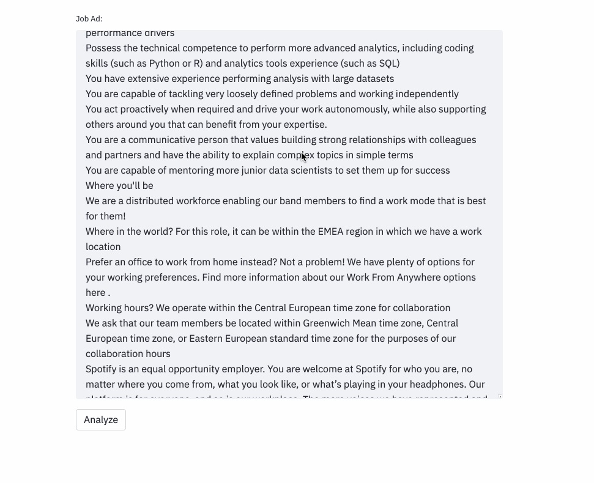
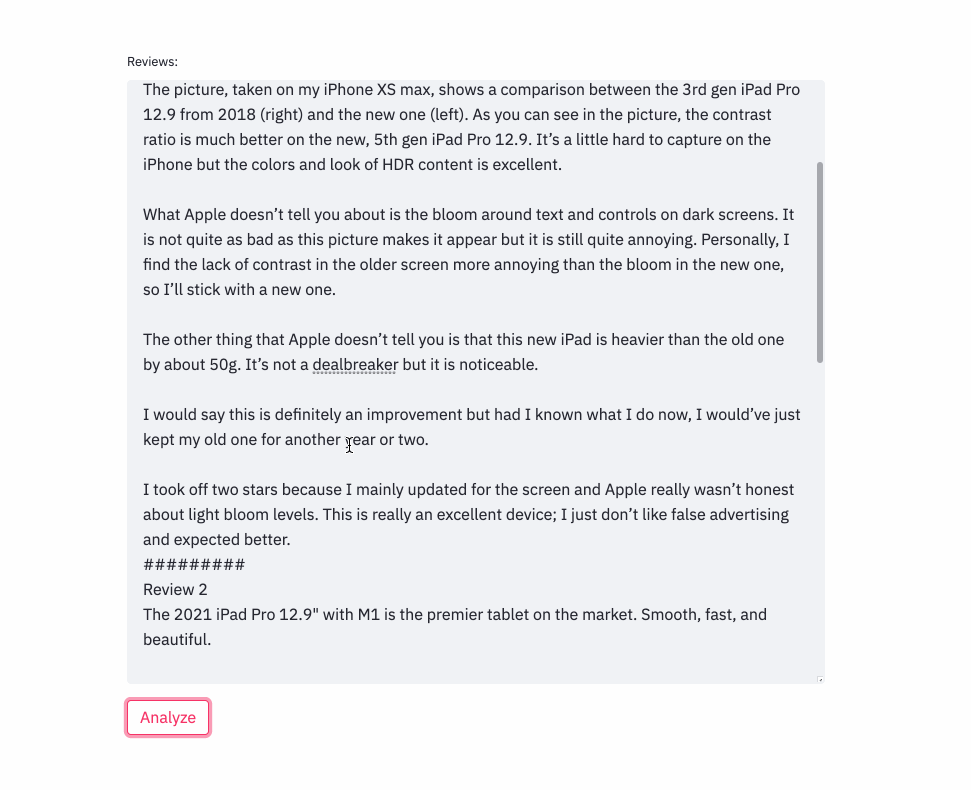

# GPT3 Use Cases

GPT 3 is currently one of the most state-of-the-art Natural Language Processing models out there in the world.

Fortunate enough to get hold of a GPT3 API key, I've been playing with it and building demos for some promising use cases, including:

- **Job Requirements Extractor**

  
It can extract job requirements quite accurately and also output the years of experience needed to apply.

The latter is insanely important because even tho I'm a junior data scientist Linkedin recommends me more-senior jobs
all the time! If Linkedin were to set up a **year-of-experience filter**, think about how much frustration, disappointment and wasted time
would be saved!

- **Job Requirements Extractor**

It can generate a list of pros and cons from customer reviews on e-commerce sites(Ipad Pro in our case), 
which can **save buyers from having to trudge through all the reviews to find constructive stuff**
(i.e. facts useful for the purchase decision making process).

## Skills covered:

- Prompt writing for GPT3 (literally only skill needed but it took me quite a while to wrap my mind around it..)

## Limitations with GPT3:

- It often **repeats itself**
- **Unstable output**(the output may change drastically even with a slight variation of the prompt, such as paraphrasing or even just adding a new space)
- Input size is limited (difficult to pack in more than a few long text examples in the prompt. However, it's possible to fine-tune/re-train the model with customized examples)
